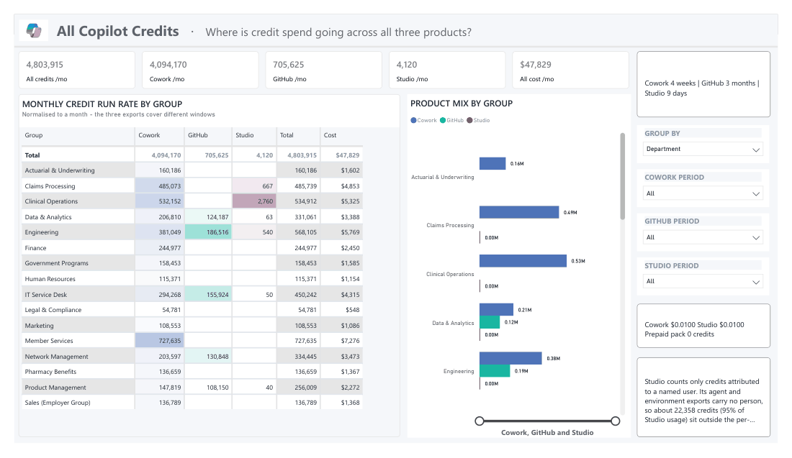

# 💳 Consumption Central

### *for Microsoft Copilot* — one Power BI template for **Copilot credit consumption and cost**

**What you're consuming · what it costs · where to trim · what next year looks like**

### 🎬 Watch first

| | | |
|---|---|---|
| **[▶ Demo](media/ConsumptionCentral-Demo.mp4)** | What the report covers, page by page | **1m 51s** |
| **[▶ Setup guide](media/ConsumptionCentral-Setup.mp4)** | Getting your own data in — every source, start to finish | **7m 12s** |

*Click either link, then press **Download** on the GitHub page to play.*

---

## What is it

A Power BI report covering Copilot spend across **Cowork/Work IQ**, **Copilot Studio**,
**GitHub Copilot** and **Azure AI Foundry**.

Fifteen pages: each product gets consumption, cost, optimisation and forecast, plus a combined
overview.

---

## You don't need all of it

> ### **No product is required. One is enough.**

Load whatever you have. The rest of the pages come up empty and nothing breaks.

| I have… | I get |
|---|---|
| **One product** | That product's four pages |
| **Two or more** | Those, plus the combined overview |

Department breakdowns are optional too. Without them you still get every credit and cost figure —
you just can't split them by team.

---

## Pick a path

| | Best when | Setup |
|---|---|---|
| **[1. Local CSV](1.%20Local%20CSV/)** | You want to see it working today | ~10 minutes |
| **[2. Fabric](2.%20Fabric/)** | You want it refreshing weekly on its own | An afternoon |
| **[3. Viva Direct](3.%20Viva%20Direct/)** | You want Cowork data with no files at all | ~10 minutes |

**Not sure?** Start with **Local CSV**. It tells you whether the numbers are worth automating before
you automate anything.

Each folder has its own short guide with the exact steps.

---

## Two things you'll be asked for

When the template opens it asks for a few values. Almost all have sensible defaults — these are the
two worth thinking about:

| | |
|---|---|
| **Where your data is** | A folder path, a Lakehouse name, or two IDs from Viva — depends on your path |
| **What a credit costs you** | List price is **$0.01**. Change it only if your agreement differs |

Everything else can stay as it is.

---

## Try it before you commit

Every path ships with a **synthetic sample dataset**. Point the template at it and the whole report
fills in — no exports, no waiting for a billing cycle, no real data.

**[1. Local CSV/sample-data](1.%20Local%20CSV/sample-data/)**

### Narrated walkthroughs

| | What it covers |
|---|---|
| **[▶ Demo](media/ConsumptionCentral-Demo.mp4)** *(1m 51s)* | A tour of the fifteen pages and what each one answers |
| **[▶ Setup guide](media/ConsumptionCentral-Setup.mp4)** *(7m 12s)* | Every data source — which ones automate, which need a download, and the admin consent Viva needs before it will name a user |

Both are narrated. Click through and press **Download** on the GitHub page to play.

---

## More detail, when you want it

| | |
|---|---|
| [Where the data comes from](docs/DATA-SOURCES.md) | Click-paths and permissions for every export |
| [Department breakdowns](docs/ORG-DATA.md) | How org attributes get in, and what happens without them |
| [Rates and pricing](docs/COMMERCIAL-TERMS.md) | What to set and where to find it |
| [Every measure explained](docs/MEASURES.md) | Reference — for when a number surprises you |

---

## Status

Built and tested end to end against live tenant data on all three paths. The sample dataset is
synthetic; no customer data is in this repo.

Not supported through Microsoft support channels — **[open an issue](../../issues)** instead.

<strong>Usage &amp; compliance</strong>

This template helps you understand your own Copilot consumption and cost. Microsoft has no
visibility into the data you load, nor control over how the template is used. You are responsible
for ensuring your use complies with applicable law, including data privacy and employment law.
Microsoft disclaims all liability arising from use of this template.

Several underlying exports are **in preview**, and the identifiable variant of the Viva Insights
export processes personal data. Review the "Previews" section of the Microsoft Products and Services
Data Protection Addendum before enabling it, and consult your works council or privacy office where
per-person reporting requires it.

---

## Contributing

Issues and pull requests welcome — see [CONTRIBUTING.md](CONTRIBUTING.md).

## Trademarks

This project may contain trademarks or logos for projects, products, or services. Authorized use of
Microsoft trademarks or logos is subject to and must follow
[Microsoft's Trademark & Brand Guidelines](https://www.microsoft.com/legal/intellectualproperty/trademarks/usage/general).
Use of third-party trademarks or logos is subject to those third-parties' policies.
